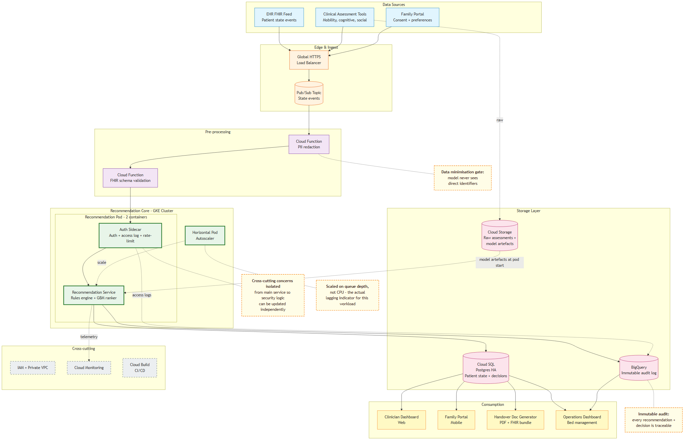
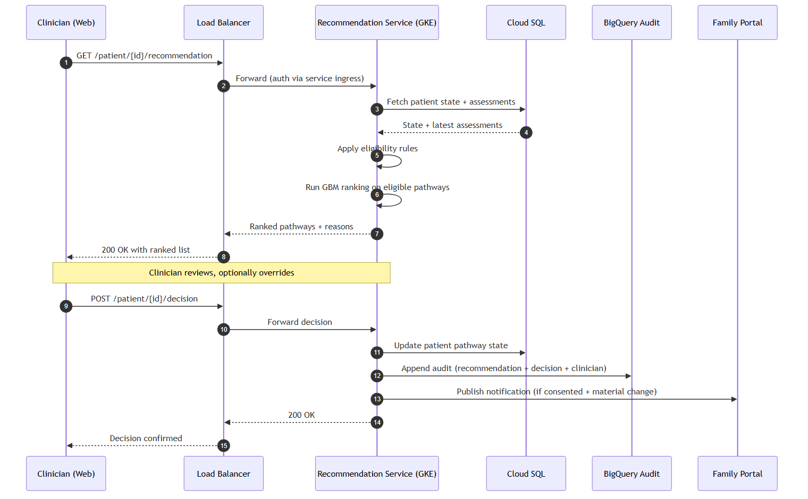

# Discharge Pathway Coordination Service

A cloud architecture design for a service that helps clinicians and families track patients through the care pathway and match each patient to the most appropriate discharge route. May 2026.



## The problem

When a patient is medically fit for discharge, the question of *where they go next* (home with a support package, rehabilitation unit, community hospital, residential care, end-of-life care) is one of the largest sources of delayed transfers of care in acute hospitals. Coordinating across these options today is largely manual, leaving clinicians chasing assessments and families without a reliable picture of what is supposed to happen next.

This project designs a cloud platform for a fictional multi-site healthcare provider that closes the gap by ingesting patient state events from the hospital EHR, applying a hybrid rules + machine learning ranker, and surfacing recommendations to clinicians through a web dashboard and to families through a consent-gated mobile portal.

## What is in the architecture

- **Compute:** Google Kubernetes Engine (GKE), with a two-container pod pattern (recommendation service + auth sidecar)
- **Ingest:** Global HTTPS Load Balancer in front of Cloud Pub/Sub, decoupling burst-prone EHR events from inference capacity
- **Pre-processing:** Cloud Function for PII redaction (data minimisation gate) plus a second Cloud Function for FHIR R5 schema validation
- **Recommendation core:** Deterministic eligibility rules plus a gradient-boosted ranking model (XGBoost), with SHAP-based explanations returned alongside each ranking
- **State:** Cloud SQL Postgres (HA, zone-redundant) for patient state; BigQuery as the immutable audit log
- **Object store:** Cloud Storage for raw assessments and versioned model artefacts
- **Reliability:** Multi-zone deployment in the primary region with an active-passive warm standby in a second region; failover driven by Global Load Balancer health checks
- **Cross-cutting:** IAM with a private VPC, Cloud Monitoring, Cloud Build for CI/CD, Terraform for infrastructure-as-code

## Key design decisions

- **GKE over fully serverless:** the always-on patient-state path benefits from warm capacity rather than per-request cold starts, which would be unacceptable during ward rounds.
- **Sidecar pattern over an edge proxy fleet:** the same principle hyperscalers use to centralise cross-cutting concerns (auth, logging, rate-limiting), applied at the right scale for a single recommendation service.
- **Hybrid rules + ML over a pure neural network:** the rules give auditable boundaries that clinicians and regulators can inspect; the model handles the ranking nuance rules alone cannot.
- **Active-passive multi-region over active-active:** active-active would reduce idle cost but means coordinating writes across two regions, which is hard to keep safe for clinical state.
- **PII redaction before inference:** data minimisation gate so the model never sees direct identifiers.

## Request flow



A clinician opens the patient view; the recommendation service fetches state from Cloud SQL, applies the rules layer, runs the ranker on the remaining candidates, and returns a ranked list with reasons. The clinician reviews, optionally overrides, and confirms; the decision updates Cloud SQL and is appended to BigQuery, and the family portal is notified if consented and the change is material.

## Full report

The complete architecture design document (8 pages, with full Well-Architected Framework discussion across security, reliability, performance, cost, operational excellence, and sustainability + equity) is in [`report/Final_Project_AI_Cloud.pdf`](report/Final_Project_AI_Cloud.pdf).

## Repo structure

```
discharge-pathway-coordination-service/
├── README.md
├── LICENSE
├── report/
│   └── Final_Project_AI_Cloud.pdf
├── diagrams/
│   ├── 01_architecture.mmd
│   ├── 02_sequence.mmd
│   └── README.md
└── figures/
    ├── architecture.png
    └── sequence.png
```

## About

- **Author:** Gonzalo Roberto Guerrero Pichén
- **Module:** Cloud Computing for AI

## License

[MIT](LICENSE), see `LICENSE` for the full text. Use, adapt, and redistribute freely; attribution appreciated.
